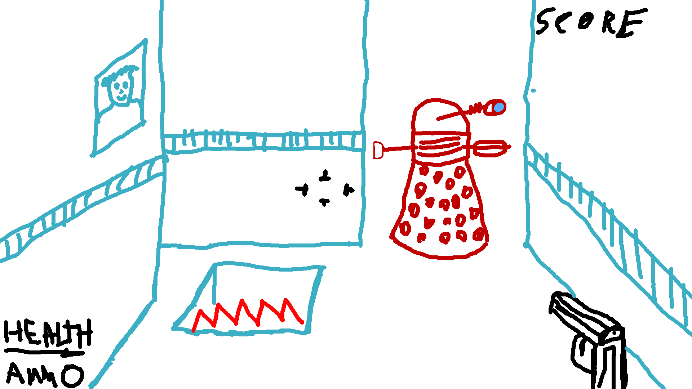

# Assignment 3 

# Table of contents

# Version History
https://github.com/aagavin/305-3D-Game/commits/develop

# Detailed Game Description
This is a first person shooter that takes place in on office. The player shoots daleks. 

# Controls
The player will use the WASD keys and the mouse to control the player

# Interface Sketch

# Screen Descriptions

# Character
The Doctor has had his memory wiped so now he's an office worker.  
 
# Enemies
Enemies include darkeks that have taken over the office

# Scoring
The player needs uses a sonic screwdriver a defeate the enemies. The player gets 10 points for every enemmy killed

# Sound Index

# Art/Multimendia Index
